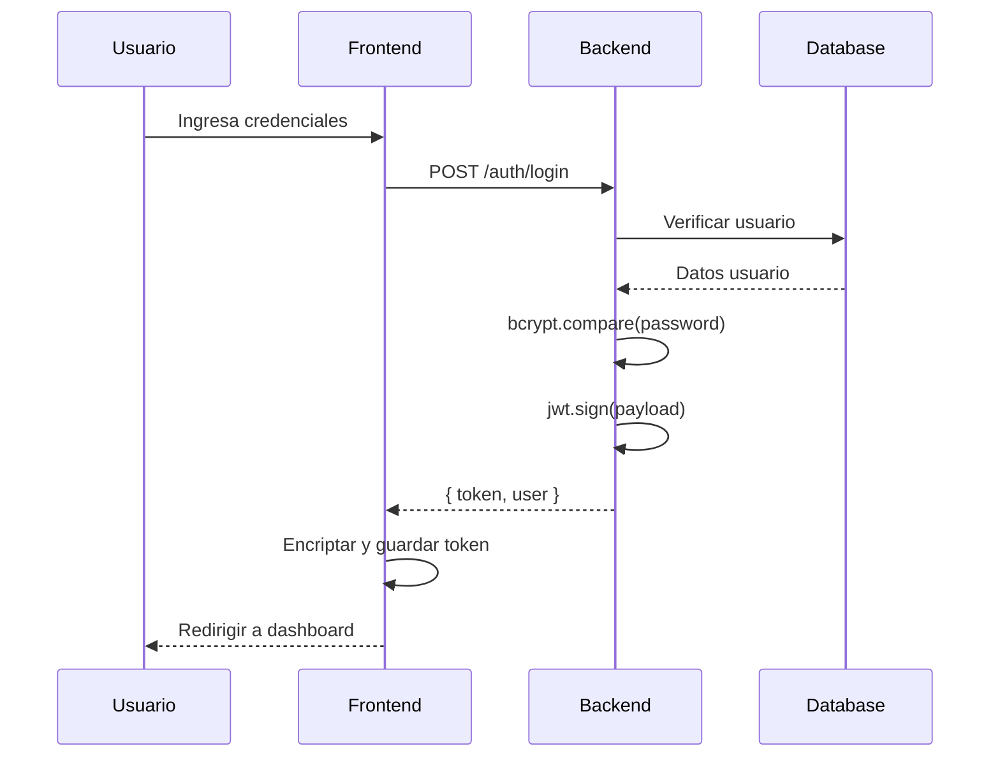

# 📚 Documentación Técnica - Buho Eats

## 🏗️ Arquitectura del Sistema

### Visión General
Buho Eats es una plataforma web de reseñas de restaurantes con arquitectura Cliente-Servidor, implementada con:
- **Frontend**: HTML5, CSS3 (Tailwind CSS), JavaScript Vanilla
- **Backend**: Node.js puro (sin frameworks)
- **Base de Datos**: SQLite3

### Arquitectura de Capas

```
┌─────────────────────────────────────────────────────────┐
│                    CAPA DE PRESENTACIÓN                  │
│  (Frontend - HTML/CSS/JavaScript + Tailwind CSS)        │
│  - Páginas dinámicas con SPA behavior                   │
│  - Componentes reutilizables (Header, Footer, Cards)    │
└───────────────────┬─────────────────────────────────────┘
                    │ HTTP/HTTPS + REST API
┌───────────────────▼─────────────────────────────────────┐
│                    CAPA DE APLICACIÓN                    │
│              (Backend - Node.js HTTP Server)             │
│  ┌─────────────────────────────────────────────────┐   │
│  │ Middleware Layer                                 │   │
│  │ - CORS, Rate Limiting, Sanitization, Auth       │   │
│  └─────────────────────┬───────────────────────────┘   │
│  ┌─────────────────────▼───────────────────────────┐   │
│  │ Controllers                                      │   │
│  │ - Auth, Restaurant, Review, Menu, User, Admin   │   │
│  └─────────────────────┬───────────────────────────┘   │
│  ┌─────────────────────▼───────────────────────────┐   │
│  │ Business Logic & Validation                      │   │
│  └─────────────────────┬───────────────────────────┘   │
└───────────────────────┬─────────────────────────────────┘
                        │
┌───────────────────────▼─────────────────────────────────┐
│                  CAPA DE PERSISTENCIA                    │
│                   (SQLite Database)                      │
│  - Transacciones ACID                                   │
│  - Integridad referencial con Foreign Keys              │
└─────────────────────────────────────────────────────────┘
```

---

## 🗄️ Modelo de Base de Datos

### Diagrama Entidad-Relación

```
┌──────────────┐         ┌───────────────┐         ┌──────────────┐
│    USERS     │         │  RESTAURANTS  │         │   REVIEWS    │
├──────────────┤         ├───────────────┤         ├──────────────┤
│ id (PK)      │────┐    │ id (PK)       │────┐    │ id (PK)      │
│ email        │    │    │ name          │    │    │ user_id (FK) │
│ first_name   │    │    │ owner_id (FK) │◄───┤    │ restaurant_id│
│ last_name    │    │    │ description   │    │    │ rating       │
│ password     │    └───►│ address       │    └───►│ comment      │
│ role         │         │ cuisine_type  │         │ visit_date   │
│ is_active    │         │ is_active     │         │ created_at   │
│ strikes      │         │ average_rating│         │ updated_at   │
│ created_at   │         │ total_reviews │         └──────────────┘
└──────────────┘         └───────────────┘                │
       │                        │                         │
       │                        │                         │
       └────────────┬───────────┴─────────────┬──────────┘
                    │                         │
            ┌───────▼─────────┐      ┌────────▼──────────┐
            │   FAVORITES     │      │  REVIEW_REPORTS   │
            ├─────────────────┤      ├───────────────────┤
            │ id (PK)         │      │ id (PK)           │
            │ user_id (FK)    │      │ review_id (FK)    │
            │ restaurant_id   │      │ reporter_id (FK)  │
            │ created_at      │      │ reason            │
            └─────────────────┘      │ status            │
                                     │ created_at        │
            ┌─────────────────┐      └───────────────────┘
            │   MENU_ITEMS    │
            ├─────────────────┤
            │ id (PK)         │
            │ restaurant_id   │
            │ name            │
            │ description     │
            │ price           │
            │ category        │
            │ image_url       │
            │ is_available    │
            └─────────────────┘
```

### Tablas Principales

#### 1. **users**
```sql
CREATE TABLE users (
    id INTEGER PRIMARY KEY AUTOINCREMENT,
    email TEXT UNIQUE NOT NULL,
    password TEXT NOT NULL,
    first_name TEXT NOT NULL,
    last_name TEXT NOT NULL,
    role TEXT DEFAULT 'user' CHECK(role IN ('user', 'owner', 'admin')),
    is_active INTEGER DEFAULT 1,
    strikes INTEGER DEFAULT 0,
    profile_photo TEXT,
    created_at DATETIME DEFAULT CURRENT_TIMESTAMP,
    updated_at DATETIME DEFAULT CURRENT_TIMESTAMP
);
```

**Roles del Sistema:**
- `user`: Usuario regular (puede hacer reseñas, agregar favoritos)
- `owner`: Propietario de restaurante (gestiona su restaurante y menú)
- `admin`: Administrador (gestiona reportes, usuarios, y sistema completo)

#### 2. **restaurants**
```sql
CREATE TABLE restaurants (
    id INTEGER PRIMARY KEY AUTOINCREMENT,
    owner_id INTEGER NOT NULL,
    name TEXT NOT NULL,
    description TEXT,
    address TEXT NOT NULL,
    phone TEXT,
    cuisine_type TEXT,
    price_range TEXT CHECK(price_range IN ('$', '$$', '$$$', '$$$$')),
    image_url TEXT,
    average_rating REAL DEFAULT 0,
    total_reviews INTEGER DEFAULT 0,
    is_active INTEGER DEFAULT 1,
    created_at DATETIME DEFAULT CURRENT_TIMESTAMP,
    updated_at DATETIME DEFAULT CURRENT_TIMESTAMP,
    FOREIGN KEY (owner_id) REFERENCES users(id)
);
```

#### 3. **reviews**
```sql
CREATE TABLE reviews (
    id INTEGER PRIMARY KEY AUTOINCREMENT,
    restaurant_id INTEGER NOT NULL,
    user_id INTEGER NOT NULL,
    rating INTEGER NOT NULL CHECK(rating >= 1 AND rating <= 5),
    comment TEXT NOT NULL,
    visit_date DATE,
    created_at DATETIME DEFAULT CURRENT_TIMESTAMP,
    updated_at DATETIME DEFAULT CURRENT_TIMESTAMP,
    FOREIGN KEY (restaurant_id) REFERENCES restaurants(id) ON DELETE CASCADE,
    FOREIGN KEY (user_id) REFERENCES users(id),
    UNIQUE(restaurant_id, user_id)
);
```

**Restricción importante**: Un usuario solo puede tener UNA reseña por restaurante.

#### 4. **review_reports**
```sql
CREATE TABLE review_reports (
    id INTEGER PRIMARY KEY AUTOINCREMENT,
    review_id INTEGER NOT NULL,
    reporter_id INTEGER NOT NULL,
    reason TEXT NOT NULL CHECK(reason IN ('spam', 'ofensivo', 'falso', 'inapropiado', 'otro')),
    status TEXT DEFAULT 'pendiente' CHECK(status IN ('pendiente', 'aprobado', 'rechazado')),
    created_at DATETIME DEFAULT CURRENT_TIMESTAMP,
    FOREIGN KEY (review_id) REFERENCES reviews(id) ON DELETE CASCADE,
    FOREIGN KEY (reporter_id) REFERENCES users(id)
);
```

**Motivos de Reporte:**
- `spam`: Spam o publicidad
- `ofensivo`: Contenido ofensivo
- `falso`: Información falsa o engañosa
- `inapropiado`: Contenido inapropiado
- `otro`: Otro motivo

---

## 🔐 Sistema de Autenticación y Autorización

### JWT (JSON Web Tokens)

**Estructura del Token:**
```javascript
{
  "id": 123,
  "email": "usuario@ejemplo.com",
  "role": "user",
  "iat": 1234567890,
  "exp": 1234574890
}
```

**Tiempo de vida**: 2 horas

**Almacenamiento Frontend**:
- Token encriptado con timestamp de expiración
- Almacenado en localStorage con doble capa de seguridad
- Verificación de expiración en cada petición

### Middleware de Autenticación

```javascript
// 1. authenticateToken - Verifica token válido
// 2. requireRole - Verifica rol específico
// 3. optionalAuth - Auth opcional (no bloquea si no hay token)
```

### Matriz de Permisos

| Endpoint | Público | User | Owner | Admin |
|----------|---------|------|-------|-------|
| GET /restaurants | ✅ | ✅ | ✅ | ✅ |
| POST /reviews | ❌ | ✅ | ❌ | ❌ |
| GET /favorites | ❌ | ✅ | ❌ | ❌ |
| GET /owner/restaurant | ❌ | ❌ | ✅ | ❌ |
| GET /admin/stats | ❌ | ❌ | ❌ | ✅ |

---

## 🛡️ Medidas de Seguridad Implementadas

### 1. **Protección contra Ataques**

#### XSS (Cross-Site Scripting)
```javascript
// Sanitización en Frontend
function escapeHtml(text) {
    const map = {
        '&': '&amp;',
        '<': '&lt;',
        '>': '&gt;',
        '"': '&quot;',
        "'": '&#039;'
    };
    return text.replace(/[&<>"']/g, m => map[m]);
}

// Sanitización en Backend
const sanitizeMiddleware = require('./middleware/sanitize');
```

#### SQL Injection
```javascript
// Uso de prepared statements
query('SELECT * FROM users WHERE email = ?', [email]);
// ❌ NUNCA: query(`SELECT * FROM users WHERE email = '${email}'`);
```

#### CSRF (Cross-Site Request Forgery)
- Token JWT en header Authorization
- Verificación de origen con CORS

#### Rate Limiting
```javascript
// Límites por endpoint
POST /auth/login: 5 peticiones / 15 minutos
POST /auth/register: 3 peticiones / hora
POST /reviews: 10 peticiones / hora
```

### 2. **Validación de Datos**

```javascript
// Validación de email
/^[a-zA-Z0-9._-]+@[a-zA-Z0-9.-]+\.[a-zA-Z]{2,}$/

// Validación de contraseña
- Mínimo 8 caracteres
- 1 mayúscula
- 1 minúscula
- 1 número
- 1 carácter especial

// Validación de rating
CHECK(rating >= 1 AND rating <= 5)
```

### 3. **Encriptación**

```javascript
// Contraseñas con bcrypt
const hash = await bcrypt.hash(password, 10);
const isValid = await bcrypt.compare(password, hash);

// Tokens JWT con secret key
const token = jwt.sign(payload, process.env.JWT_SECRET);
```

### 4. **Token Blacklist**

```javascript
// Tokens invalidados almacenados en memoria
const blacklistedTokens = new Set();

// Al hacer logout, el token se invalida inmediatamente
addToBlacklist(token);
```

### 5. **Protección de Rutas Frontend**

```javascript
// Verificación de rol antes de cargar página
function protectRoute() {
    const page = document.body.getAttribute('data-page');
    
    if (page === 'dashboard-admin') {
        if (!Auth.requireRole('admin')) return;
    }
    
    if (page === 'owner-restaurant') {
        if (!Auth.requireRole('owner')) return;
    }
    
    if (page === 'dashboard-user') {
        if (!Auth.requireRole('user')) return;
    }
}
```

---

## 🚀 API REST Endpoints

### Autenticación

```
POST   /api/auth/register      - Registro de usuario
POST   /api/auth/login         - Inicio de sesión
POST   /api/auth/logout        - Cerrar sesión
GET    /api/auth/verify        - Verificar token
```

### Restaurantes

```
GET    /api/restaurants              - Listar restaurantes (público)
GET    /api/restaurants/:id          - Detalle restaurante (público)
POST   /api/restaurants              - Crear restaurante (owner)
PUT    /api/restaurants/:id          - Actualizar restaurante (owner)
DELETE /api/restaurants/:id          - Eliminar restaurante (owner)
```

### Reseñas

```
GET    /api/reviews                  - Listar reseñas (público)
POST   /api/reviews                  - Crear reseña (user)
PUT    /api/reviews/:id              - Actualizar reseña (user)
DELETE /api/reviews/:id              - Eliminar reseña (user)
```

### Favoritos

```
GET    /api/favorites                - Obtener favoritos (user)
POST   /api/favorites                - Agregar favorito (user)
DELETE /api/favorites                - Eliminar favorito (user)
POST   /api/favorites/check          - Verificar favorito (user)
```

### Owner

```
GET    /api/owner/restaurant         - Ver mi restaurante (owner)
PUT    /api/owner/restaurant         - Actualizar restaurante (owner)
PUT    /api/owner/restaurant/photo   - Actualizar foto (owner)
GET    /api/owner/menu               - Ver menú (owner)
POST   /api/owner/menu               - Agregar item (owner)
PUT    /api/owner/menu/:id           - Actualizar item (owner)
DELETE /api/owner/menu/:id           - Eliminar item (owner)
POST   /api/owner/reviews/:id/report - Reportar reseña (owner)
GET    /api/owner/stats              - Estadísticas (owner)
```

### Admin

```
GET    /api/admin/stats                      - Estadísticas generales
GET    /api/admin/reports                    - Reportes pendientes
POST   /api/admin/reports/:id/approve        - Aprobar reporte
POST   /api/admin/reports/:id/reject-review  - Rechazar y eliminar reseña
POST   /api/admin/reports/:id/reject-with-strike - Eliminar + Strike
GET    /api/admin/users                      - Listar usuarios
POST   /api/admin/users/:id/ban              - Banear usuario
POST   /api/admin/users/:id/unban            - Desbanear usuario
GET    /api/admin/restaurants                - Listar todos los restaurantes
```

---

## 📦 Estructura del Proyecto

### Backend
```
Buho-Eats-Backend/
├── server.js                 # Servidor HTTP principal
├── package.json              # Dependencias
├── config/
│   ├── database.js           # Configuración SQLite
│   └── env.js                # Variables de entorno
├── controllers/
│   ├── authController.js     # Autenticación
│   ├── restaurantController.js
│   ├── reviewController.js
│   ├── menuController.js
│   ├── userController.js
│   ├── favoritesController.js
│   ├── ownerController.js
│   └── adminController.js
├── middleware/
│   ├── auth.js               # JWT verification
│   ├── cors.js               # CORS config
│   ├── rateLimit.js          # Rate limiting
│   └── sanitize.js           # Input sanitization
├── routes/
│   └── api.js                # Definición de rutas
├── utils/
│   ├── hash.js               # bcrypt helpers
│   ├── jwt.js                # JWT helpers
│   ├── logger.js             # Sistema de logs
│   ├── validator.js          # Validaciones
│   └── tokenBlacklist.js     # Token blacklist
├── database/
│   ├── init.sql              # Schema inicial
│   └── buho-eats.db          # Base de datos SQLite
└── scripts/
    ├── initDatabase.js       # Inicializar DB
    ├── fixAdminPassword.js   # Resetear admin
    └── runMigration.js       # Migraciones
```

### Frontend
```
Buho-Eats-Frontend/
├── index.html                # Landing page
├── pages/
│   ├── login.html
│   ├── signup.html
│   ├── dashboard-user.html   # Dashboard usuario
│   ├── dashboard-admin.html  # Dashboard admin
│   ├── owner-restaurant.html # Gestión restaurante
│   ├── owner-stats.html      # Estadísticas owner
│   ├── restaurant-detail.html
│   ├── favorites.html
│   └── profile.html
├── components/
│   ├── header.html           # Header reutilizable
│   └── footer.html           # Footer reutilizable
├── assets/
│   ├── css/
│   │   ├── main.css
│   │   └── reset.css
│   ├── js/
│   │   ├── config.js         # Configuración API
│   │   ├── auth.js           # Autenticación
│   │   ├── api.js            # Cliente HTTP
│   │   ├── main.js           # Inicialización
│   │   ├── header.js         # Lógica header
│   │   ├── utils.js          # Utilidades
│   │   ├── admin.js          # Funciones admin
│   │   ├── owner-restaurant.js
│   │   ├── restaurant-api.js
│   │   ├── restaurant-card.js
│   │   ├── restaurant-detail.js
│   │   ├── favorites.js
│   │   ├── profile.js
│   │   ├── carousel.js
│   │   └── dialog.js         # Modales
│   └── img/
│       ├── restaurants/      # Imágenes restaurantes
│       └── menu/             # Imágenes menú
└── libs/
    └── tailwind.js           # Tailwind CSS
```

---

## 🔄 Flujos de Trabajo Principales

### 1. Registro e Inicio de Sesión



### 2. Sistema de Strikes y Baneo

```
Usuario crea reseña inapropiada
         ↓
Owner reporta reseña
         ↓
Admin revisa reporte
         ↓
    ┌────────────┐
    │ Aprobar    │ → Reporte cerrado
    │            │
    │ Rechazar   │ → Reseña eliminada
    │            │
    │ Strike     │ → Reseña eliminada + Strike al usuario
    └────────────┘
         ↓
   Strike += 1
         ↓
    ¿Strikes >= 3?
    │
    ├─ NO → Usuario puede seguir usando el sistema
    │
    └─ SÍ → Usuario BANEADO automáticamente
            - is_active = 0
            - Todas sus reseñas eliminadas (hard delete)
            - No puede iniciar sesión
```

### 3. Desactivación de Owner

```
Admin banea a un Owner
         ↓
    ┌──────────────────────────┐
    │ User baneado:            │
    │ - is_active = 0          │
    │ - strikes = 3            │
    │ - Todas reseñas borradas │
    └──────────────────────────┘
         ↓
    ┌──────────────────────────┐
    │ Restaurante desactivado: │
    │ - is_active = 0          │
    │ - NO aparece en búsquedas│
    │ - NO accesible por users │
    └──────────────────────────┘
         ↓
Admin desbanea al Owner
         ↓
    ┌──────────────────────────┐
    │ User reactivado:         │
    │ - is_active = 1          │
    │ - strikes = 0            │
    └──────────────────────────┘
         ↓
    ┌──────────────────────────┐
    │ Restaurante reactivado:  │
    │ - is_active = 1          │
    │ - Vuelve a aparecer      │
    └──────────────────────────┘
```

---

## 📊 Casos de Uso

### Usuario Regular
1. Registrarse / Iniciar sesión
2. Buscar restaurantes por nombre, tipo de cocina, rating
3. Ver detalles de restaurante (menú, reseñas, ubicación)
4. Crear/editar/eliminar sus reseñas (1 por restaurante)
5. Agregar/quitar favoritos
6. Ver su perfil y actualizar información
7. Cambiar contraseña
8. Subir foto de perfil

### Propietario (Owner)
1. Registrarse como propietario (incluye datos del negocio)
2. Gestionar su restaurante (info, foto, horarios)
3. Gestionar menú (agregar, editar, eliminar items)
4. Ver estadísticas (total reseñas, rating promedio, visitas)
5. Reportar reseñas inapropiadas
6. Ver su perfil

### Administrador
1. Ver dashboard con estadísticas generales
2. Gestionar reportes de reseñas
   - Aprobar (cerrar reporte)
   - Rechazar reseña (eliminar)
   - Rechazar con strike (eliminar + penalizar)
3. Gestionar usuarios
   - Ver lista completa
   - Banear/desbanear usuarios
   - Ver historial de strikes
4. Gestionar restaurantes
   - Ver todos (activos e inactivos)
   - Ver estado de cada uno
5. Ver estadísticas del sistema

---

## 🧪 Testing y Validación

### Cuentas de Prueba

```javascript
// Usuario Regular
email: usuario@test.com
password: User123!

// Propietario
email: owner@test.com
password: Owner123!

// Administrador
email: admin@buho.com
password: Admin123!
```

### Escenarios de Prueba

1. ✅ Registro e inicio de sesión
2. ✅ CRUD de reseñas
3. ✅ Sistema de favoritos
4. ✅ Reportes de reseñas
5. ✅ Sistema de strikes y baneo automático
6. ✅ Desactivación de owner con restaurante
7. ✅ Protección de rutas por rol
8. ✅ Validación de datos
9. ✅ Manejo de errores
10. ✅ Token expiration y logout

---

## 🐛 Manejo de Errores

### Códigos de Estado HTTP

```
200 OK              - Operación exitosa
201 Created         - Recurso creado
400 Bad Request     - Datos inválidos
401 Unauthorized    - No autenticado
403 Forbidden       - No tiene permisos
404 Not Found       - Recurso no existe
409 Conflict        - Conflicto (ej: email duplicado)
429 Too Many Requests - Rate limit excedido
500 Internal Error  - Error del servidor
```

### Sistema de Logs

```javascript
// Niveles de log
logger.info('Operación exitosa');
logger.warn('Advertencia');
logger.error('Error controlado');
logger.exception(error, context);
```

---

## 📝 Mantenimiento

### Scripts Útiles

```bash
# Inicializar base de datos limpia
node scripts/initDatabase.js

# Resetear contraseña de admin
node scripts/fixAdminPassword.js

# Ejecutar migraciones
node scripts/runMigration.js
```

### Respaldos de Base de Datos

```bash
# Backup manual
cp database/buho-eats.db database/backup-$(date +%Y%m%d).db
```
---

**Versión**: 1.0.0  
**Fecha**: Noviembre 2025  
**Estado**: Producción Ready ✅
